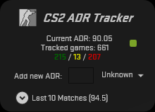

CS2 ADR Tracker
===============

An easy to use application to keep track of your global ADR. 
Simply add your ADR after each game.

---

### Enjoying this?
Just star the repo or make a donation.

Your help is valuable since this is a hobby project for all of us: we do development during out-of-office hours.

### Contribution
Pull requests are very welcome.

### Copyrights
CS2 ADR Tracker was initially written by **Markus Karl Wackermann**.
