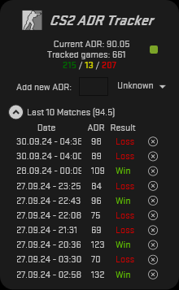

CS2 ADR Tracker
===============

A desktop application written in C# using WPF for tracking and analyzing your ADR (Average Damage per Round) in Counter-Strike 2 matches.
 
The application allows you to manually enter your ADR score and the outcome of each game, then processes the data to help you evaluate your overall performance.

## Features

- **Manual ADR Input**: Enter the ADR score and outcome (win/loss/draw) for each match.
- **Overall ADR Calculation**: Automatically calculates and displays your overall ADR across all tracked matches.
- **Last 10 Games ADR**: Displays the average ADR of your last 10 games for quick trend analysis.
- **Game Results Summary**: Shows a count of all games, along with the count of wins and losses.
- **Simple WPF UI**: An intuitive and responsive interface built with WPF for easy input and tracking.

## Screenshots

|  |  |  |
|-------------------------------|-------------------------------|-------------------------------|

---

## Enjoying this?
Just star the repo or make a donation.

Your help is valuable since this is a hobby project for all of us: we do development during out-of-office hours.

## Contribution
Pull requests are very welcome.

## Copyrights
CS2 ADR Tracker was initially written by **Markus Karl Wackermann**.

## License

This project is licensed under the MIT License. See the [LICENSE](LICENSE.txt) file for details.
